# American Option Greeks via Pathwise LSMC

This repository contains a notebook-first study of American option pricing and delta estimation with Longstaff-Schwartz Monte Carlo (LSMC), focused on numerical accuracy, validation, and computational efficiency.

## Project Goal

We study a 1D American put under GBM and build the project in four parts:

1. pricing baseline with LSMC,
2. delta baselines with finite difference and pathwise estimation,
3. one technical extension beyond the core delta study,
4. a unified numerical comparison across estimators.

The current repository completes the core Part 1 and Part 2 scope, includes an exploratory Part 3 extension, and includes a first integrated Part 4 comparison notebook.

## Reference Paper

The main paper currently cited by the project is:

- Longstaff, F. A., & Schwartz, E. S. (2001). *Valuing American Options by Simulation: A Simple Least-Squares Approach*. *The Review of Financial Studies, 14*(1), 113-147. [https://doi.org/10.1093/rfs/14.1.113](https://doi.org/10.1093/rfs/14.1.113)

This paper anchors the pricing side of the project:

- American put pricing under GBM,
- least-squares Monte Carlo valuation,
- regression-based continuation estimation,
- weighted Laguerre basis functions,
- replication against the published benchmark setup.

## Implemented Scope

The current implemented scope is:

- LSMC pricing for an American put,
- LS2001 pricing replication,
- finite-difference delta with common random numbers,
- fixed-policy pathwise delta,
- validation against binomial and finite-difference PDE benchmarks,
- robustness checks for path count, bump size, and regression basis,
- a unified estimator comparison across delta, runtime, accuracy, and robustness aspects,
- and an exploratory likelihood-ratio / mixed-estimator extension.

## Repository Layout

### Current Implemented Layout

```text
src/lsmc_greeks/
  models.py
  payoffs.py
  pricer.py
  utils.py
  greeks/
    finite_diff.py
    pathwise.py
    likelihood.py
    mixed.py
  benchmarks/
    binomial.py
    finite_difference.py

notebooks/
  01_ls2001_replication.ipynb
  02_lsmc_baseline_and_fd_delta.ipynb
  03_pathwise_delta.ipynb
  04_LR_Mixed_Estimator.ipynb
  06_estimator_comparison.ipynb

assets/figures/
  ls2001_replication_ee_comparison.png
  finite_difference_delta_baseline.png
  finite_difference_delta_spot_sweep.png
  finite_difference_delta_bump_sensitivity.png
  pathwise_delta_baseline_comparison.png
  pathwise_delta_path_count.png
  pathwise_delta_bump_sensitivity.png
  pathwise_delta_basis_sensitivity.png
  estimator_comparison_spot_sweep.png
  estimator_comparison_accuracy_runtime.png
  estimator_comparison_path_count.png

tests/
  test_lsmc_baseline.py
```

### Notebook Roadmap

The current repo implements `01`, `02`, `03`, `04`, and `06`. Notebook `04` is currently an exploratory extension study. Notebook `05` has not yet been added and is planned as a later extension.

```text
notebooks/
  01_ls2001_replication.ipynb
  02_lsmc_baseline_and_fd_delta.ipynb
  03_pathwise_delta.ipynb
  04_basis_and_gamma_extension.ipynb or 04_regression_sensitivity.ipynb
  05_lr_or_mixed_extension.ipynb
  06_estimator_comparison.ipynb
```

## Environment

A minimal Conda environment is provided in `environment.yml`.

Core dependencies:

- `numpy`
- `scipy`
- `pandas`
- `matplotlib`
- `notebook`
- `ipykernel`

## Methods

### Pricing

The pricing baseline uses Longstaff-Schwartz Monte Carlo for a Bermudan approximation to the American put. The continuation regression is built from weighted Laguerre basis functions, and the implementation supports basis-sensitivity experiments through the `basis_degree` parameter.

### Core Delta Estimators

Two core LSMC delta estimators are currently implemented and used in the main validation/comparison story:

- `src/lsmc_greeks/greeks/finite_diff.py`: central bump-and-revalue with common random numbers,
- `src/lsmc_greeks/greeks/pathwise.py`: fixed-policy pathwise delta, where the learned LSMC stopping rule is held fixed during differentiation.

### Exploratory Extension Estimators

The repo also includes exploratory Part 3 extensions:

- `src/lsmc_greeks/greeks/likelihood.py`: likelihood-ratio delta/gamma estimator,
- `src/lsmc_greeks/greeks/mixed.py`: mixed estimator combining pathwise delta with LR gamma.

These extensions are useful for experimentation, but they are not yet presented as being validated to the same standard as the core finite-difference and pathwise delta estimators.

### Validation Benchmarks

Two independent benchmark layers are used:

- `src/lsmc_greeks/benchmarks/binomial.py`,
- `src/lsmc_greeks/benchmarks/finite_difference.py`.

This reduces dependence on any single reference method.

### Fixed-Policy Interpretation

The pathwise estimator should be interpreted carefully. The American option value is an optimal-stopping problem, while the implemented pathwise estimator differentiates the discounted payoff under the learned LSMC stopping rule and treats that stopping rule as fixed during differentiation.

Benchmark agreement supports this estimator empirically, but it does not by itself prove that the implementation is computing the exact derivative of the true optimal-stopping value. In the report, this method should be framed as a validated first-order estimator under a fixed-policy assumption.

## Outline of the Project

### Part 1: Pricing Baseline
- GBM simulation,
- payoff logic,
- LSMC pricing,
- LS2001 replication,
- benchmark setup foundation.

### Part 2: Delta Baselines
- finite-difference delta with common random numbers,
- pathwise delta under a fixed-policy assumption,
- validation against binomial and PDE benchmarks,
- initial robustness checks.

### Part 3: Advanced Extension
- exploratory likelihood-ratio estimator,
- exploratory mixed estimator,
- a dedicated extension notebook for those methods.

### Part 4: Unified Numerical Comparison
- repeated-seed point-estimate comparison at the baseline,
- spot-sweep comparison against binomial and PDE benchmarks,
- runtime versus accuracy comparison,
- path-count scaling diagnostics,
- consolidated robustness summary.

## Notebook Storyline

The canonical notebook sequence is:

1. `notebooks/01_ls2001_replication.ipynb`: validate the pricing baseline against LS2001.
2. `notebooks/02_lsmc_baseline_and_fd_delta.ipynb`: establish the finite-difference delta baseline.
3. `notebooks/03_pathwise_delta.ipynb`: compare pathwise delta against the baseline and the external benchmarks.
4. `notebooks/04_LR_Mixed_Estimator.ipynb`: exploratory extension notebook for likelihood-ratio and mixed Greek estimators.
5. `notebooks/06_estimator_comparison.ipynb`: integrate the two core LSMC delta estimators into one comparison framework, covering point estimates, spot sweep, runtime versus accuracy, path-count scaling, and a consolidated robustness table.

The planned `05` notebook remains future extension work and has not yet been completed.

All analysis notebooks in the current project structure live under `notebooks/`.

## Results

### Pricing Baseline

The pricing layer was first validated against the LS2001 American put benchmark.

Summary diagnostics from `notebooks/01_ls2001_replication.ipynb`:

- mean absolute early-exercise-premium difference: `0.010229`
- max absolute early-exercise-premium difference: `0.036640`
- rows with `|diff| <= 0.01`: `12/20`

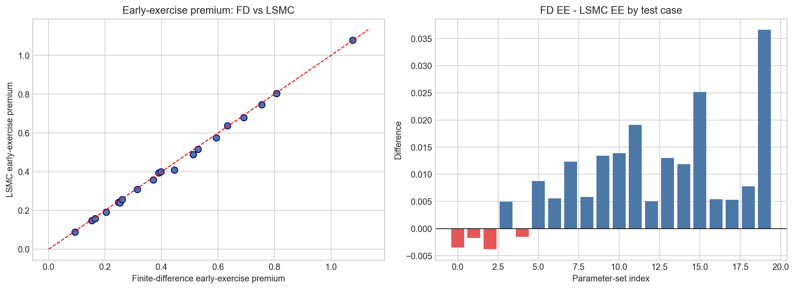

### Finite-Difference Delta Baseline

At the baseline case `S=40, K=40, r=0.06, sigma=0.20, T=1`:

- LSMC price: `2.314678`
- LSMC finite-difference delta: `-0.412321`
- binomial benchmark delta: `-0.404959`
- PDE benchmark delta: `-0.405150`
- absolute error versus binomial: `0.007363`
- absolute error versus PDE: `0.007171`
- runtime: `0.189245` seconds

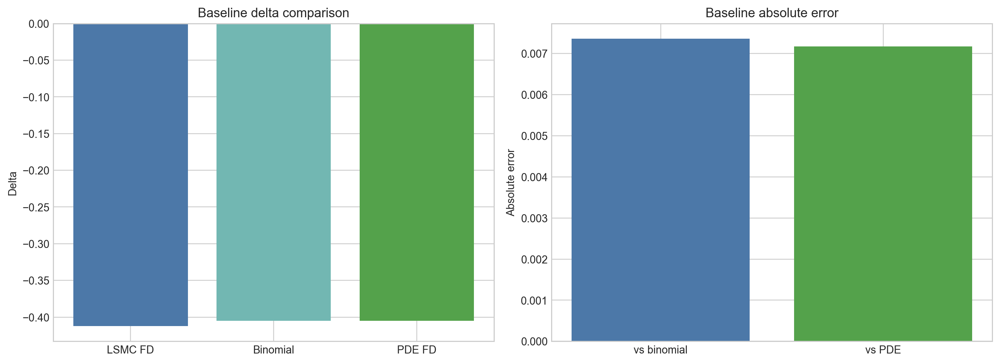

Across the spot sweep `S=36, 38, 40, 42, 44`, the finite-difference estimator tracks the benchmark curves closely, with the largest absolute error versus the binomial benchmark around `0.010215` at `S=38`.

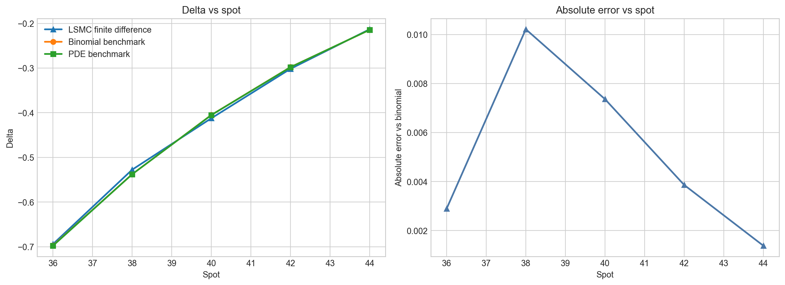

The bump sweep shows the main practical weakness of bump-and-revalue: the estimate changes materially when the bump is very small.

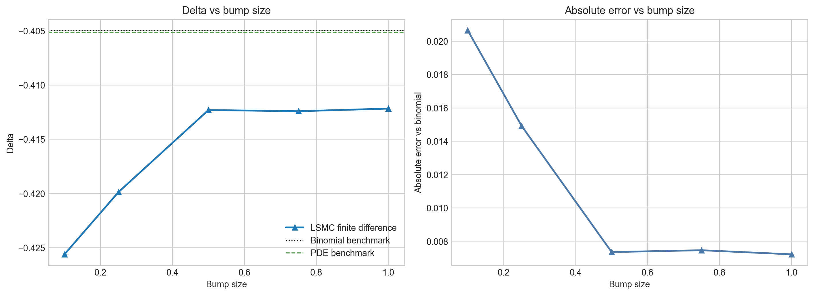

### Baseline Delta Comparison

At the same baseline case, the pathwise estimator is closer to the binomial benchmark than the LSMC finite-difference baseline in the current run.

| Method | Delta | Std. Error | Runtime (s) | Abs. Error vs Binomial |
| --- | ---: | ---: | ---: | ---: |
| LSMC finite difference | -0.412321 |  | 0.196072 | 0.007363 |
| LSMC pathwise | -0.400928 | 0.002106 | 0.103443 | 0.004031 |
| Binomial benchmark | -0.404959 |  |  | 0.000000 |
| Finite-difference benchmark | -0.405150 |  |  | 0.000191 |

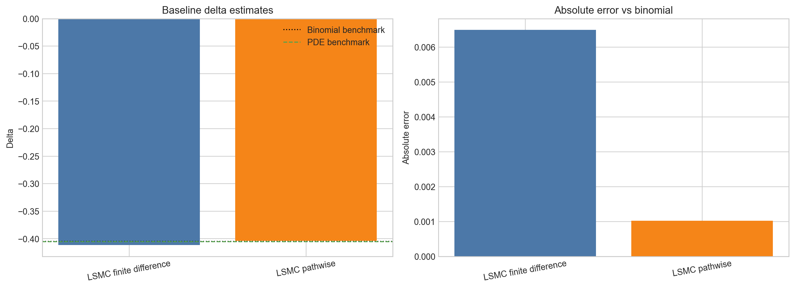

This is a benchmarked result for the current configuration, not a claim that pathwise is always better.

### Robustness Findings

#### Path Count

Using repeated seeds over path counts `5,000`, `10,000`, `20,000`, and `40,000`, the pathwise estimator remains competitive while running faster than bump-and-revalue in the current implementation.

Selected repeated-seed mean absolute errors versus the binomial benchmark:

- `5,000` paths: FD `0.007654`, pathwise `0.007982`
- `10,000` paths: FD `0.011839`, pathwise `0.008359`
- `20,000` paths: FD `0.006979`, pathwise `0.004351`
- `40,000` paths: FD `0.003269`, pathwise `0.005014`

The figure below should be read as a repeated-seed summary with variability bars, not as a claim of exact monotone convergence.

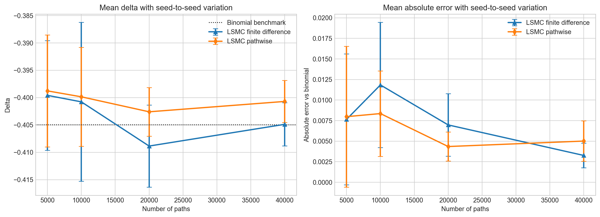

#### Bump Size

At the baseline configuration with `20,000` paths, the pathwise estimate stays fixed at `-0.399138`, while the finite-difference estimate varies from `-0.425612` at a `0.10` bump to roughly `-0.4122` for larger bumps.

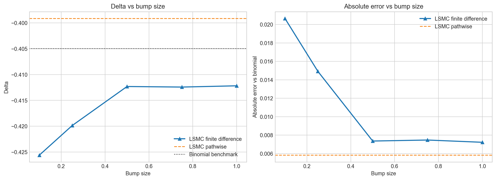

#### Basis Sensitivity

In the current benchmark configuration, the LSMC price and both delta estimators move as the regression basis changes. This matters because the pathwise estimator inherits model risk from the learned stopping rule, not just Monte Carlo noise.

At basis degrees `0, 1, 2, 3`, the pathwise absolute error versus the binomial benchmark is approximately:

- `0.020502`
- `0.006442`
- `0.005821`
- `0.002846`

The figure is best read as a sensitivity check for this setup, not as a universal ranking of basis choices.

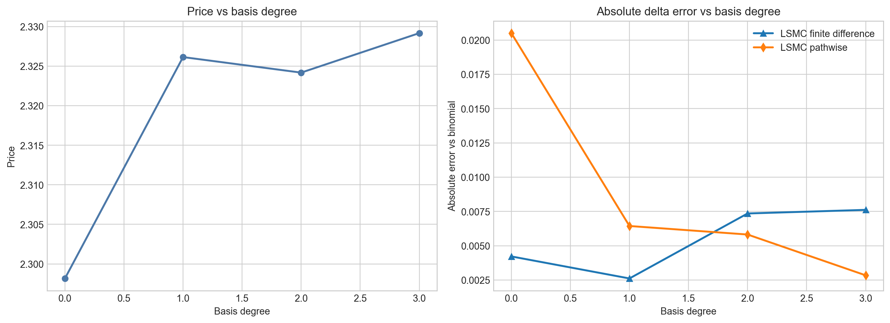

### Unified Estimator Comparison

Notebook `06_estimator_comparison.ipynb` integrates the two core LSMC delta estimators into one comparison framework. All LSMC numbers below are repeated-seed means with seed-to-seed standard errors, using `30` seeds at the baseline, `15` seeds for the path-count scaling sweep, and `basis_degree=3` weighted Laguerre throughout.

#### Baseline Point Estimate

At `S=40, K=40, r=0.06, sigma=0.20, T=1` with `20,000` paths and `30` seeds:

| Method | Delta | Seed SE | Mean Runtime (s) | Abs. Error vs Binomial | Abs. Error vs PDE |
| --- | ---: | ---: | ---: | ---: | ---: |
| LSMC finite difference | -0.401809 | 0.001216 | 0.3511 | 0.002982 | 0.003053 |
| LSMC pathwise | -0.400733 | 0.001013 | 0.1828 | 0.004058 | 0.004129 |
| Binomial benchmark | -0.404791 |  |  | 0.000000 | 0.000071 |
| PDE benchmark | -0.404862 |  |  | 0.000071 | 0.000000 |

The two benchmarks agree to about `7e-5`, which is the practical floor for the LSMC errors in this configuration. Both LSMC estimators land within roughly `2-3` seed SEs of the benchmarks, with similar Seed SEs in this run. The Seed SE column for finite difference is new relative to the earlier README baseline table, where bump-and-revalue was reported without a standard error.

#### Spot Sweep

Across `S = 36, 38, 40, 42, 44`, both LSMC estimators track the benchmark curves closely, with no systematic bias visible in either direction:

| Spot | Pathwise mean | Pathwise SE | FD mean | FD SE | Binomial | PDE |
| ---: | ---: | ---: | ---: | ---: | ---: | ---: |
| 36 | -0.69292 | 0.00109 | -0.69486 | 0.00205 | -0.69655 | -0.69696 |
| 38 | -0.53318 | 0.00132 | -0.53622 | 0.00191 | -0.53723 | -0.53745 |
| 40 | -0.40285 | 0.00067 | -0.40500 | 0.00123 | -0.40479 | -0.40486 |
| 42 | -0.29654 | 0.00067 | -0.29721 | 0.00130 | -0.29798 | -0.29782 |
| 44 | -0.21402 | 0.00058 | -0.21536 | 0.00072 | -0.21436 | -0.21408 |

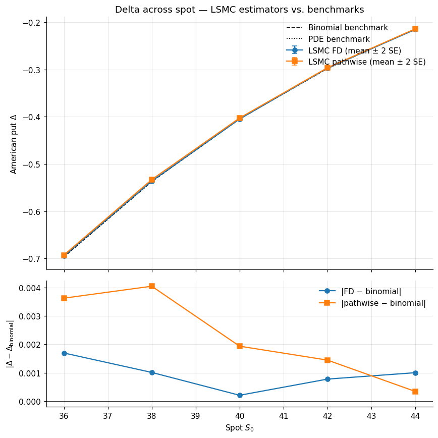

#### Runtime versus Accuracy

The headline figure of the unified comparison plots each `(seed, estimator)` run as a single point: x-axis is wall-clock runtime per run, y-axis is absolute error against the binomial benchmark. A method sitting **down and to the left** is favoured for this configuration.

At the baseline with `30` seeds and `20,000` paths:

- LSMC finite difference: mean runtime `0.351 s`, mean absolute error `0.00491` (SE `0.00098`).
- LSMC pathwise: mean runtime `0.183 s`, mean absolute error `0.00525` (SE `0.00080`).

Pathwise is roughly twice as fast on average, with absolute error within Monte Carlo noise of bump-and-revalue.

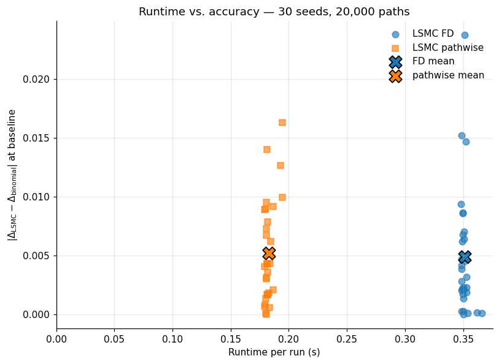

#### Path-Count Scaling

Repeated-seed mean absolute error against the binomial benchmark, using `15` seeds at each path count:

| N paths | Pathwise MAE | Pathwise MAE SE | FD MAE | FD MAE SE | Pathwise runtime (s) | FD runtime (s) |
| ---: | ---: | ---: | ---: | ---: | ---: | ---: |
| 5,000 | 0.00402 | 0.00101 | 0.01854 | 0.00401 | 0.048 | 0.092 |
| 10,000 | 0.00584 | 0.00105 | 0.00786 | 0.00123 | 0.092 | 0.180 |
| 20,000 | 0.00493 | 0.00073 | 0.00487 | 0.00089 | 0.181 | 0.350 |
| 40,000 | 0.00360 | 0.00069 | 0.00284 | 0.00046 | 0.382 | 0.732 |

Both estimators broadly track the expected `N^{-1/2}` Monte Carlo convergence reference. The runtime panel confirms the structural factor-of-two between the two methods at every path count, since bump-and-revalue requires two repricings per call while pathwise requires one.

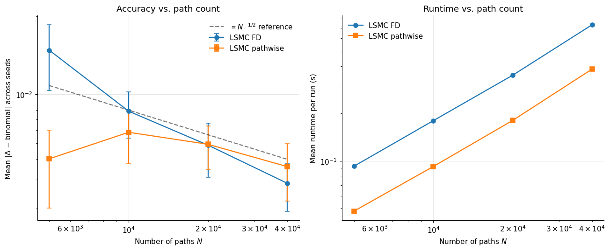

#### Robustness Summary

The detailed sweeps live in notebook `03`; the unified comparison consolidates the analysis:

| Aspects | LSMC finite difference | LSMC pathwise |
| --- | --- | --- |
| Bump parameter | required, estimate depends on choice | not applicable |
| Bump sensitivity over `[0.1, 1.0]` | spread of about `0.013` in estimates | invariant |
| Regression basis degree | depends on basis | depends on basis via the learned stopping rule |
| Basis sensitivity, degree `0` to `3` | non-trivial | non-trivial, error from about `0.020` to `0.003` |
| Seed-to-seed variance at `20,000` paths | comparable to pathwise | comparable to FD |

The key practical asymmetry is the bump parameter. Both estimators inherit basis dependence through the same learned LSMC stopping rule, so this is a shared model-risk axis rather than a pathwise-specific weakness.

## Interpretation

The project takeaway is that pathwise delta is promising because it:

- avoids the extra tuning parameter required by bump-and-revalue,
- compares reasonably well with independent numerical benchmarks,
- runs roughly twice as fast as bump-and-revalue at the configurations studied,
- and remains competitive across the current robustness sweeps.

The unified comparison in notebook `06` adds two pieces of evidence: at the baseline, both LSMC estimators agree with the binomial and PDE benchmarks within their seed SEs, and the runtime advantage of pathwise is consistent with its structural cost (one LSMC pricing pass instead of two).

The exploratory LR/mixed extension work in notebook `04` is useful as an extension study, but it is not yet part of the core validated project narrative. In its current form, it should be presented as additional exploration rather than as a result on the same footing as the finite-difference and pathwise delta study.

The main caveat is also central to the project:

- the current pathwise estimator treats the learned LSMC stopping rule as fixed during differentiation,
- both estimators inherit the same regression-basis sensitivity through the learned stopping rule.


For the report, this should be described as a validated first-order estimator for delta, not as a complete treatment of the American exercise-boundary derivative.

## Reproducibility

- Core implementation lives in `src/`.
- Notebook analysis and presentation live in `notebooks/`.
- Report-ready figures are generated into `assets/figures/`.
- Random-number generation is explicit so later estimators can share common random numbers.
- Validation uses both binomial and finite-difference benchmark solvers.

## Testing

The current baseline includes tests for:

- GBM path generation,
- payoff logic,
- LS2001 pricing sanity checks,
- binomial and finite-difference benchmark behavior,
- finite-difference estimator metadata,
- pathwise delta sign and benchmark consistency,
- Laguerre basis-size behavior.

Run the test suite with:

```bash
python -m unittest discover -s tests -v
```

## Work Distribution

This is the current work split reflected in the repository.

### Yee Yang: Pricing Infrastructure Lead

Owns:

- `src/lsmc_greeks/models.py`
- `src/lsmc_greeks/payoffs.py`
- `src/lsmc_greeks/utils.py`
- `notebooks/01_ls2001_replication.ipynb`

### JiaHerng Yap: LSMC Pricer + Basis/Regression Lead

Owns:

- `src/lsmc_greeks/pricer.py`
- the basis and regression logic inside the pricer,
- the future Part 3 basis/regression extension notebook, suggested as `04_basis_and_gamma_extension.ipynb` or `04_regression_sensitivity.ipynb`.

### Chen Ming Hui: Finite-Difference Delta + Extension Lead

Owns:

- `src/lsmc_greeks/greeks/finite_diff.py`
- `notebooks/02_lsmc_baseline_and_fd_delta.ipynb`
- the current exploratory extension notebook `04_LR_Mixed_Estimator.ipynb`
- the future `05_lr_or_mixed_extension.ipynb`, planned as a later extension if the LR/mixed work is refactored into a more polished follow-up notebook.

### Yueran Yu: Pathwise Delta + Benchmarks + Comparison Lead

Owns:

- `src/lsmc_greeks/greeks/pathwise.py`
- `src/lsmc_greeks/benchmarks/binomial.py`
- `src/lsmc_greeks/benchmarks/finite_difference.py`
- `notebooks/03_pathwise_delta.ipynb`
- the current unified comparison notebook `06_estimator_comparison.ipynb`.

